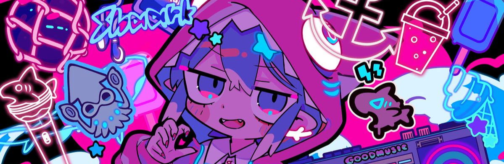

<table style="border: 0;">
  <tr style="border: 0;"> 
    <td style="border: 0;" rowspan ="3">
        
    </td>
    <td style="border: 0;">
        <h1>DEKXISOSTA <br> GITHUB</h1>
        <h6>PROGRAM / UI DESIGN / GAME <br> DEVELOPMENT </h6>
    </td>
    <td style="border: 0;">
        
        <br>
        
        <br>
        
    </td>
    <td style="border: 0;">
        
        <br>
        
        <br>
        
    </td>
  </tr>
</table>

```lua
--Currently learning Luau
function Dekxi.new(isSilly : boolean) : Dekxi
    local self = setmetatable({}, Dekxi)
    self.Actions = {"coding", "designing", "developing"}
    𝗮𝘀𝘀𝗲𝗿𝘁(not isSilly, "I am " .. tostring(self.Actions[math.random(1, #self.Actions)]))
    return self
end
```
