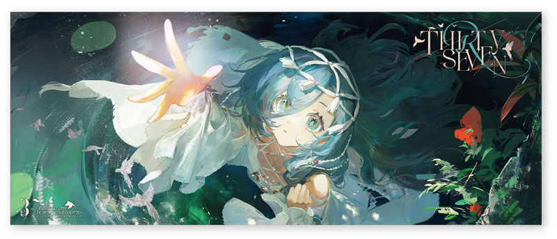

  

---

<table align="center">
  <tr>
    <td>
      <h3 align="center">
        "With my code,  
        I will carve a better world. 
        This is my dream." 
        — dekxi
      </h3>
    </td>
    <td>
      

        <strong> 🪻 OTHER SKILLSETS </strong> 
        => 2D Sketching, Graphic Design  
        => 3D Modelling, Game Design, etc.  
        <strong> 🪻 LATEST ACHIEVEMENT </strong> 
        => 2025 National Codechum Competition Finalist
      

    </td>
  </tr>
</table>     

---

##  🛠️ dekxi_py's Current Tech Stack !!

  
  
  
  
  
  
  

  
  
  
  
  
  

  
  
  
  
  

  
  
  

##  🛠️ dekxi_py's Currently Learning !!

  
  
  
  
  
  

---

- It's my longest wish to have more programmer friends! Don't hesitate to message me at discord miyuacchiii. 
- I'm also open for collaborations! Let's grind well together!

